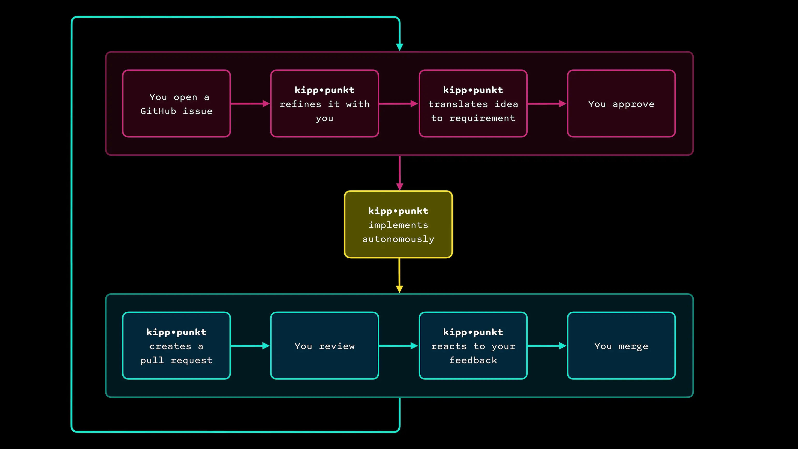

Software engineering is going through a paradigm shift. AI agents can already write code. But sitting in a terminal watching them type is just the next intermediary. 

The real shift looks different.

## The agentic engineer

If agents are good enough to write code by themselves, the engineering role changes focus: **refining ideas into specs** and **reviewing outcomes**. A new kind of engineer emerges: someone who is product manager, architect, and engineer at once, steering AI agents instead of writing code by hand.

A single high-performing engineer with the right toolchain can ship what used to require a team.

## From idea to merge

kipp•punkt is a toolchain for this new workflow. It covers the full loop from idea to shipped code.

You operate at the edges: shaping intent and approving results. Everything in between is automated. No IDE, no terminal, no desk. Open an issue from your phone on the train. Review the PR from a café. Ship from anywhere, anytime.

## Meets you where you are

As software engineers, we build on decades of battle-tested practices. Requirements engineering, feedback loops, continuous integration. AI doesn't replace any of that. If anything, it raises the bar.

kipp•punkt integrates with the tools you already use, GitHub issues, PRs, and your terminal, as smoothly as possible. No new UI to visit. No new workflow to learn.
